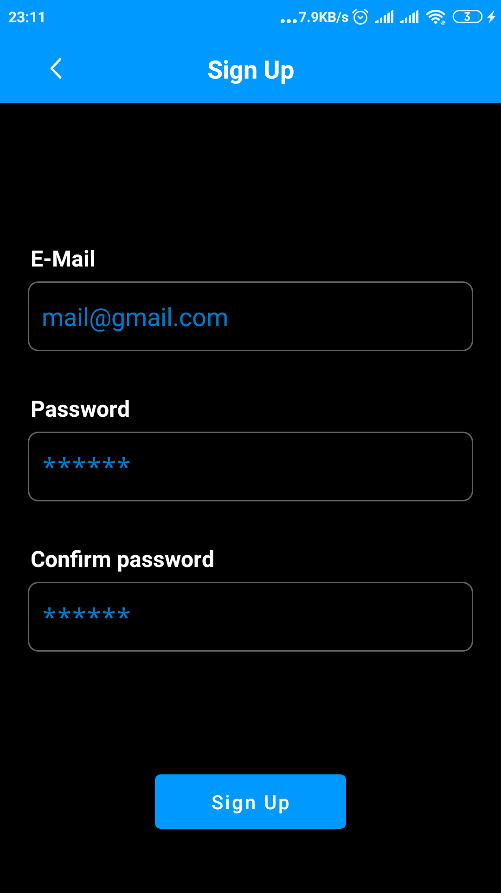
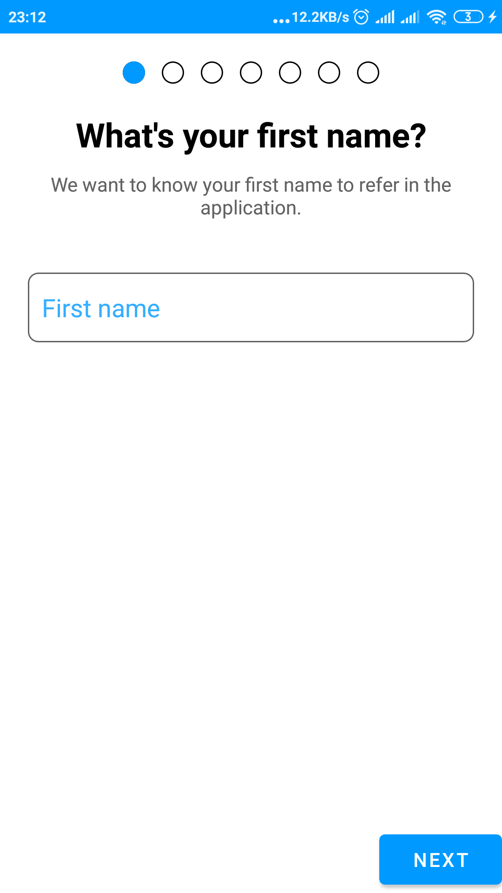

# Healthify
## Your tracker

Healthify is tracker-based activity, which helps you track your steps, walked sitance, weight, water and sleep.

## Features

- Track step/walked distance
- Track sleep/weight/water
- Onboarding
- Daily statistics

## Screenshots

## Used libraries
**Firebase-Auth** - for authentication  
**Firebase-Firestore**  - for storing user data  
**Koin** - for dependecy injection  
**Coroutines** - for asynchronous calls  
**Navigation component** - for navigation  
**Room** - for storing user data locally  
**Dots indicator**   
**Gson**  
**Glide**   
**Progress Bar**  
